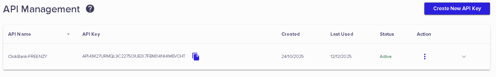

# 🚨 FIX URGENT - ClickBank API Health Check

## Problème
L'endpoint `/api/clickbank/health` retourne: `{"status":"error","message":"Cannot reach ClickBank API"}`

## Cause
Les variables d'environnement sur Vercel ne sont pas correctement configurées selon le format attendu par l'API ClickBank.

## Solution Immédiate


### Option 1: Modifier les Variables d'Environnement sur Vercel (RECOMMANDÉ)

Allez sur votre projet Vercel backend (`affiliate-rhonat-delta`) et modifiez:

**Variables actuelles:**
```
CLICKBANK_DEV_KEY = API-KM27URMQL9C2275OIUEIX7FBMX4NHIM6VCHT
CLICKBANK_API_KEY = KM27URMQL9C2275OIUEIX7FBMX4NHIM6VCHT
```

**Nouvelles variables (format correct):**
```
CLICKBANK_DEV_KEY = KM27URMQL9C2275OIUEIX7FBMX4NHIM6VCHT
CLICKBANK_API_KEY = API-KM27URMQL9C2275OIUEIX7FBMX4NHIM6VCHT
```

OU (selon la documentation ClickBank, les deux peuvent être identiques):
```
CLICKBANK_DEV_KEY = KM27URMQL9C2275OIUEIX7FBMX4NHIM6VCHT
CLICKBANK_API_KEY = KM27URMQL9C2275OIUEIX7FBMX4NHIM6VCHT
```

### Option 2: Modifier le Code Backend

Si le format actuel est correct selon votre compte ClickBank, modifiez `backend/src/services/clickbank.service.ts` ligne 50:

**Actuel:**
```typescript
const credentials = `${this.devKey}:${this.apiKey}`;
```

**Nouveau (si DEV_KEY inclut déjà "API-"):**
```typescript
// Retirer le préfixe "API-" du devKey si présent
const cleanDevKey = this.devKey.replace(/^API-/, '');
const credentials = `${cleanDevKey}:${this.apiKey}`;
```

## Étapes à Suivre

### 1. Vérifier le Format Correct sur ClickBank

Connectez-vous à votre compte ClickBank et vérifiez le format exact de vos clés API dans:
- Settings → API Keys

### 2. Mettre à Jour sur Vercel

1. Allez sur https://vercel.com/dashboard
2. Sélectionnez le projet `affiliate-rhonat-delta`
3. Settings → Environment Variables
4. Modifiez `CLICKBANK_DEV_KEY` et `CLICKBANK_API_KEY` selon le format correct
5. **IMPORTANT**: Redéployez le backend après modification

### 3. Redéployer

Après avoir modifié les variables d'environnement:
```bash
# Option A: Redéploiement automatique via Vercel
# Les variables seront prises en compte au prochain déploiement

# Option B: Forcer un redéploiement
cd backend
git commit --allow-empty -m "Trigger redeploy for env vars"
git push
```

### 4. Tester

Une fois redéployé, testez:
```bash
curl https://affiliate-rhonat-delta.vercel.app/api/clickbank/health
```

Résultat attendu:
```json
{
  "status": "ok",
  "message": "ClickBank API is reachable"
}
```

## Format d'Authentification ClickBank

ClickBank utilise Basic Authentication avec le format:
```
Authorization: Basic base64(DEV_KEY:API_KEY)
```

Selon la documentation ClickBank:
- **DEV_KEY**: Votre Developer Key (sans préfixe)
- **API_KEY**: Votre API Key (peut être identique au DEV_KEY)

## Vérification Locale

Pour tester localement avant de redéployer:

1. Créez un fichier `.env` dans `backend/`:
```env
PORT=3001
CLICKBANK_DEV_KEY=KM27URMQL9C2275OIUEIX7FBMX4NHIM6VCHT
CLICKBANK_API_KEY=KM27URMQL9C2275OIUEIX7FBMX4NHIM6VCHT
CLICKBANK_BASE_URL=https://api.clickbank.com
FRONTEND_URL=http://localhost:5173
NODE_ENV=development
```

2. Lancez le backend:
```bash
cd backend
npm run dev
```

3. Testez:
```bash
curl http://localhost:3001/api/clickbank/health
```

## Ressources

- [ClickBank API Documentation](https://api.clickbank.com/rest/1.3/doc)
- [ClickBank Authentication Guide](https://support.clickbank.com/hc/en-us/articles/220374588)
